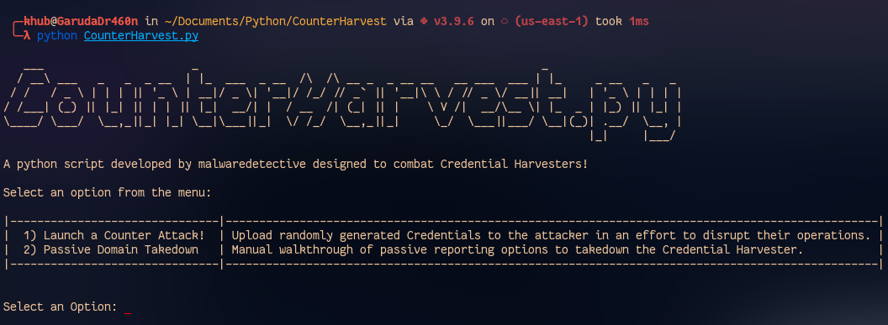
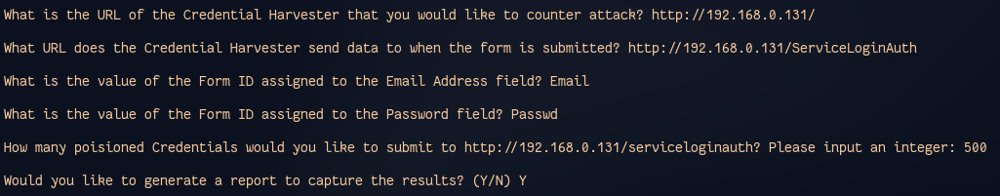
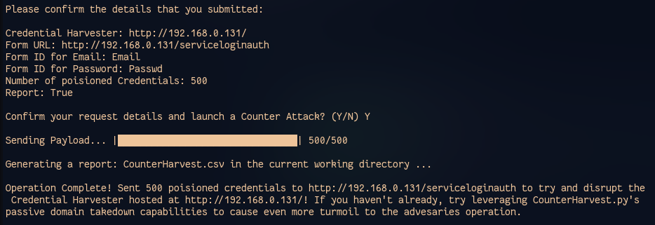
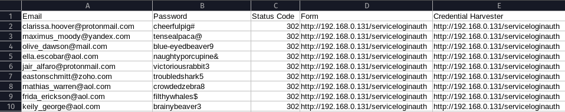

# CounterHarvest

## Description
A python script designed to combat Credential Harvesters!



Credential Harvesters are malicious web sites designed to impersonate legitimate login services. The objective of these web sites is to Social Engineer victims into inputting their Usernames/Password so that attacks can steal their login information. CounterHarvest.py is designed to disrupt these attacks by supplying the attackers with poisioned credentials that are randomly generated. 

## Requirements
- Python ≥ 3.0
- Non-standard Python Libraries
  - requests
  - progress
  - python-whois

## Usage
- Download the CounterHarvest repository.
```
git clone https://github.com/malwaredetective/CounterHarvest.git
```
- Install the additional Python packages.
```
pip install -r requirements.txt
```
- Execute **CounterHarvest.py** within your terminal.
```
python CounterHarvest.py
```

## Launching a Counter Attack!

CounterHarvest.py will ask you a series of questions to collect information about the target. In order to leverage the offensive capabilites of CounterHarvest.py, you will need to investigate the Credential Harvester to identify some key characterisics. First, you need to identify where the Credential Harvester posts data when credentials are submitted. Next, you need to identify the Form ID's of the Username and Password fields so we know how to upload our poision credentials. Once you have that information, you're ready to attack!



You will be asked for a final confirmation before launching the attack.



If you choose to capture the results of the attack, then a .CSV titled CounterHarvest.csv will be generated in the current working directory. The report contains information about the target, the poisioned credentials, and the HTTP status code the website responded with during the attack. This can indicate whether or not your attack was successful.


